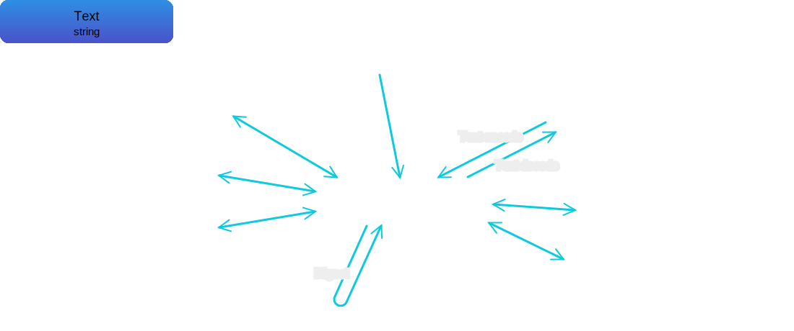

# @i-xi-dev/bytes

A JavaScript byte array library for the browser and Node.js


## Description

### Conversion



## Requirement

...


## Installation

### npm

```console
$ npm i @i-xi-dev/bytes
```

```javascript
import { ByteSequence } from "@i-xi-dev/bytes";
```

### CDN

```javascript
import { ByteSequence } from "https://unpkg.com/@i-xi-dev/bytes";
```


## Usage

...

