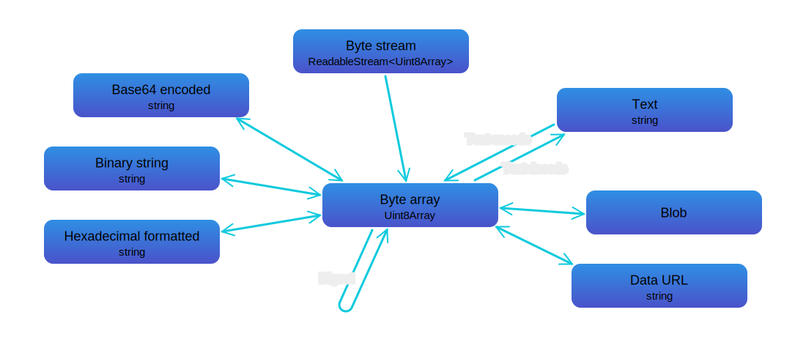

# @i-xi-dev/bytes

A JavaScript byte array library for the browser, Deno and Node.js


## Documentation

[https://i-xi-dev.github.io/bytes.es/](https://i-xi-dev.github.io/bytes.es/)


## Requirement
`ByteSequence` requires [`ReadableStream`](https://developer.mozilla.org/en-US/docs/Web/API/ReadableStream) and [`Blob`](https://developer.mozilla.org/en-US/docs/Web/API/Blob).

- Chrome
- Edge
- Firefox
- Safari
- Deno
- Node.js 16.5.0+


## Installation

### npm

```console
$ npm i @i-xi-dev/bytes
```

```javascript
import { ByteSequence } from "@i-xi-dev/bytes";
```

### CDN

Example for Skypack
```javascript
import { ByteSequence } from "https://cdn.skypack.dev/@i-xi-dev/bytes";
```


## Usage

### `ByteSequence` class



#### Creating an instance

Creates an instance with a new underlying buffer

- [ByteSequence.allocate()](https://i-xi-dev.github.io/bytes.es/classes/ByteSequence.html#allocate)
- [ByteSequence.generateRandom()](https://i-xi-dev.github.io/bytes.es/classes/ByteSequence.html#generateRandom)
- [ByteSequence.fromArrayBuffer()](https://i-xi-dev.github.io/bytes.es/classes/ByteSequence.html#fromArrayBuffer)
- [ByteSequence.fromArrayBufferView()](https://i-xi-dev.github.io/bytes.es/classes/ByteSequence.html#fromArrayBufferView)
- [ByteSequence.fromBufferSource()](https://i-xi-dev.github.io/bytes.es/classes/ByteSequence.html#fromBufferSource)
- [ByteSequence.fromArray()](https://i-xi-dev.github.io/bytes.es/classes/ByteSequence.html#fromArray)
- [ByteSequence.from()](https://i-xi-dev.github.io/bytes.es/classes/ByteSequence.html#from)
- [ByteSequence.of()](https://i-xi-dev.github.io/bytes.es/classes/ByteSequence.html#of)
- [ByteSequence.fromBinaryString()](https://i-xi-dev.github.io/bytes.es/classes/ByteSequence.html#fromBinaryString)
- [ByteSequence.fromBase64Encoded()](https://i-xi-dev.github.io/bytes.es/classes/ByteSequence.html#fromBase64Encoded)
- [ByteSequence.fromPercentEncoded()](https://i-xi-dev.github.io/bytes.es/classes/ByteSequence.html#fromPercentEncoded)
- [ByteSequence.parse()](https://i-xi-dev.github.io/bytes.es/classes/ByteSequence.html#parse)
- [ByteSequence.utf8EncodeFrom()](https://i-xi-dev.github.io/bytes.es/classes/ByteSequence.html#utf8EncodeFrom)
- [ByteSequence.textEncodeFrom()](https://i-xi-dev.github.io/bytes.es/classes/ByteSequence.html#textEncodeFrom)

Creates an instance with the specified underlying buffer

- [ByteSequence.wrapArrayBuffer()](https://i-xi-dev.github.io/bytes.es/classes/ByteSequence.html#wrapArrayBuffer)

---

#### Converting the instance to an `ArrayBuffer`

- [ByteSequence.prototype.toArrayBuffer()](https://i-xi-dev.github.io/bytes.es/classes/ByteSequence.html#toArrayBuffer)

---

#### Converting the instance to an [`ArrayBufferView`](https://developer.mozilla.org/en-US/docs/Web/API/ArrayBufferView)

- [ByteSequence.prototype.toUint8Array()](https://i-xi-dev.github.io/bytes.es/classes/ByteSequence.html#toUint8Array)
- [ByteSequence.prototype.toDataView()](https://i-xi-dev.github.io/bytes.es/classes/ByteSequence.html#toDataView)
- [ByteSequence.prototype.toArrayBufferView()](https://i-xi-dev.github.io/bytes.es/classes/ByteSequence.html#toArrayBufferView)

---

#### Converting the instance to a number array

- [ByteSequence.prototype.toArray()](https://i-xi-dev.github.io/bytes.es/classes/ByteSequence.html#toArray)
- [ByteSequence.prototype.toJSON()](https://i-xi-dev.github.io/bytes.es/classes/ByteSequence.html#toJSON)

---

#### Converting the instance to a [binary string](https://developer.mozilla.org/en-US/docs/Web/API/DOMString/Binary)

- [ByteSequence.prototype.toBinaryString()](https://i-xi-dev.github.io/bytes.es/classes/ByteSequence.html#toBinaryString)

---

#### Converting the instance to a string containing Base64 encoded bytes

- [ByteSequence.prototype.toBase64Encoded()](https://i-xi-dev.github.io/bytes.es/classes/ByteSequence.html#toBase64Encoded)

---

#### Converting the instance to a string containing percent encoded bytes

- [ByteSequence.prototype.toPercentEncoded()](https://i-xi-dev.github.io/bytes.es/classes/ByteSequence.html#toPercentEncoded)

---

#### Converting the instance to a string based on the specified format

- [ByteSequence.prototype.format()](https://i-xi-dev.github.io/bytes.es/classes/ByteSequence.html#format)
- [ByteSequence.prototype.toString()](https://i-xi-dev.github.io/bytes.es/classes/ByteSequence.html#toString)

---

#### Converting the instance to a text

- [ByteSequence.prototype.utf8DecodeTo()](https://i-xi-dev.github.io/bytes.es/classes/ByteSequence.html#utf8DecodeTo)
- [ByteSequence.prototype.textDecodeTo()](https://i-xi-dev.github.io/bytes.es/classes/ByteSequence.html#textDecodeTo)


#### Converting the instance to a [`Blob`](https://developer.mozilla.org/en-US/docs/Web/API/Blob)
```javascript
const blob = bytes1.toBlob();
// new Uint8Array(await blob.arrayBuffer()) → Uint8Array[ 0xE5, 0xAF, 0x8C, 0xE5, 0xA3, 0xAB, 0xE5, 0xB1, 0xB1 ]

const bytesFromBlob = await ByteSequence.fromBlob(blob);
bytesFromBlob.getUint8View();
// → Uint8Array[ 0xE5, 0xAF, 0x8C, 0xE5, 0xA3, 0xAB, 0xE5, 0xB1, 0xB1 ]
```

##### Blob options
```javascript
const blobOptions = {
  type: "text/plain; charset=UTF-8",
};
const blob = bytes1.toBlob(blobOptions);
// new Uint8Array(await blob.arrayBuffer()) → Uint8Array[ 0xE5, 0xAF, 0x8C, 0xE5, 0xA3, 0xAB, 0xE5, 0xB1, 0xB1 ]
// blob.type → "text/plain;charset=UTF-8"

const bytesFromBlob = await ByteSequence.fromBlob(blob);
bytesFromBlob.getUint8View();
// → Uint8Array[ 0xE5, 0xAF, 0x8C, 0xE5, 0xA3, 0xAB, 0xE5, 0xB1, 0xB1 ]
```


#### Converting the instance to a [`File`](https://developer.mozilla.org/en-US/docs/Web/API/File)

Node.js not support the `File` object

```javascript
const file = bytes1.toFile();
// new Uint8Array(await file.arrayBuffer()) → Uint8Array[ 0xE5, 0xAF, 0x8C, 0xE5, 0xA3, 0xAB, 0xE5, 0xB1, 0xB1 ]

const bytesFromFile = await ByteSequence.fromBlob(file);
bytesFromFile.getUint8View();
// → Uint8Array[ 0xE5, 0xAF, 0x8C, 0xE5, 0xA3, 0xAB, 0xE5, 0xB1, 0xB1 ]
```

##### File options
```javascript
const fileOptions = {
  type: "text/plain; charset=UTF-8",
  lastModified: 1640995200000,
};
const file2 = bytes1.toFile(fileOptions);
// new Uint8Array(await file2.arrayBuffer()) → Uint8Array[ 0xE5, 0xAF, 0x8C, 0xE5, 0xA3, 0xAB, 0xE5, 0xB1, 0xB1 ]
// file2.type → "text/plain;charset=UTF-8"
// file2.lastModified → 1640995200000

const bytesFromFile2 = await ByteSequence.fromBlob(file2);
bytesFromFile2.getUint8View();
// → Uint8Array[ 0xE5, 0xAF, 0x8C, 0xE5, 0xA3, 0xAB, 0xE5, 0xB1, 0xB1 ]
```


#### Converting the instance to a [data URL](https://developer.mozilla.org/en-US/docs/Web/HTTP/Basics_of_HTTP/Data_URIs)
```javascript
const dataUrl = bytes1.toDataURL();
// dataUrl.toString() → "data:text/plain;charset=US-ASCII;base64,5a+M5aOr5bGx"

const bytesFromDataUrl = ByteSequence.fromDataURL(dataUrl);
bytesFromDataUrl.getUint8View();
// → Uint8Array[ 0xE5, 0xAF, 0x8C, 0xE5, 0xA3, 0xAB, 0xE5, 0xB1, 0xB1 ]
```

##### Data URL options
```javascript
const dataUrlOptions = {
  type: "text/plain; charset=UTF-8",
};
const dataUrl2 = bytes1.toDataURL(dataUrlOptions);
// dataUrl2.toString() → "data:text/plain;charset=UTF-8;base64,5a+M5aOr5bGx"

const bytesFromDataUrl2 = ByteSequence.fromDataURL(dataUrl2);
bytesFromDataUrl2.getUint8View();
// → Uint8Array[ 0xE5, 0xAF, 0x8C, 0xE5, 0xA3, 0xAB, 0xE5, 0xB1, 0xB1 ]
```


---

#### Generating a digest of the instance

- [ByteSequence.prototype.toSha256Digest()](https://i-xi-dev.github.io/bytes.es/classes/ByteSequence.html#toSha256Digest)
- [ByteSequence.prototype.toSha384Digest()](https://i-xi-dev.github.io/bytes.es/classes/ByteSequence.html#toSha384Digest)
- [ByteSequence.prototype.toSha512Digest()](https://i-xi-dev.github.io/bytes.es/classes/ByteSequence.html#toSha512Digest)
- [ByteSequence.prototype.toDigest()](https://i-xi-dev.github.io/bytes.es/classes/ByteSequence.html#toDigest)

---

#### Generating a [subresource integrity](https://www.w3.org/TR/SRI/) value of the instance

- [ByteSequence.prototype.sha256Integrity](https://i-xi-dev.github.io/bytes.es/classes/ByteSequence.html#sha256Integrity)
- [ByteSequence.prototype.sha384Integrity](https://i-xi-dev.github.io/bytes.es/classes/ByteSequence.html#sha384Integrity)
- [ByteSequence.prototype.sha512Integrity](https://i-xi-dev.github.io/bytes.es/classes/ByteSequence.html#sha512Integrity)

---

#### Creating an instance by reading the [`ReadableStream`](https://developer.mozilla.org/en-US/docs/Web/API/ReadableStream) of `Uint8Array`
```javascript
// stream: ReadableStream<Uint8Array>
const bytesFromStream = await ByteSequence.fromStream(stream);
```

If you want to read [Node.js Readable stream](https://nodejs.org/api/stream.html#stream_readable_streams) of [`Buffer`](https://nodejs.org/api/buffer.html#buffer_class_buffer), you can use [`stream.Readable.toWeb`](https://nodejs.org/dist/latest-v17.x/docs/api/stream.html#streamreadabletowebstreamreadable) method (Node.js 17.0.0+)
```javascript
import { Readable } from "node:stream";

const bytesFromStream = await ByteSequence.fromStream(Readable.toWeb(nodeJsStream));
```


#### Editing the byte sequence
Gets the underlying `ArrayBuffer`
```javascript
const bytes1c = bytes1.duplicate();
const bytes1Buffer = bytes1c.buffer;

const bytes1BufferView = new Uint8Array(bytes1Buffer);

bytes1BufferView[0] = 0;
bytes1BufferView[1] = 0;
bytes1BufferView[2] = 0;

bytes1c.getUint8View();
// → Uint8Array[ 0x00, 0x00, 0x00, 0xE5, 0xA3, 0xAB, 0xE5, 0xB1, 0xB1 ]
```

Gets the `ArrayBufferView` that views the underlying `ArrayBuffer`
```javascript
const bytes1c2 = bytes1.duplicate();

const uint8ViewPart = bytes1c2.getUint8View(6, 3);
// → Uint8Array[ 0xE5, 0xB1, 0xB1 ]

uint8ViewPart[0] = 0;
uint8ViewPart[1] = 0;
uint8ViewPart[2] = 0;

bytes1c2.getUint8View();
// → Uint8Array[ 0xE5, 0xAF, 0x8C, 0xE5, 0xA3, 0xAB, 0x00, 0x00, 0x00 ]
```

```javascript
const bytes1c3 = bytes1.duplicate();

const int8ViewPart = bytes1c3.getView(Int8Array, 0, 3);
// → Int8Array[ -27, -81, -116 ]

int8ViewPart[0] = 0;
int8ViewPart[1] = 0;
int8ViewPart[2] = 0;

bytes1c3.getView(Uint8Array);
// → Uint8Array[ 0x00, 0x00, 0x00, 0xE5, 0xA3, 0xAB, 0xE5, 0xB1, 0xB1 ]
```

#### Duplicating the byte sequence
Duplicates with the new underlying `ArrayBuffer`
```javascript
const bytes1d = bytes1.duplicate();

bytes1d.getUint8View()[0] = 0;
bytes1d.toUint8Array();
// → Uint8Array[ 0x00, 0xAF, 0x8C, 0xE5, 0xA3, 0xAB, 0xE5, 0xB1, 0xB1 ]

bytes1.toUint8Array();
// → Uint8Array[ 0xE5, 0xAF, 0x8C, 0xE5, 0xA3, 0xAB, 0xE5, 0xB1, 0xB1 ]
```

Duplicates the subsequence with the new underlying `ArrayBuffer`
```javascript
const bytes1d2 = bytes1.subsequence(6, 9);

bytes1d2.getUint8View()[0] = 0;
bytes1d2.getUint8View()[1] = 0;
bytes1d2.getUint8View()[2] = 0;
bytes1d2.getUint8View();
// → Uint8Array[ 0xE5, 0xAF, 0x8C, 0xE5, 0xA3, 0xAB, 0x00, 0x00, 0x00 ]

bytes1.getUint8View();
// → Uint8Array[ 0xE5, 0xAF, 0x8C, 0xE5, 0xA3, 0xAB, 0xE5, 0xB1, 0xB1 ]
```
